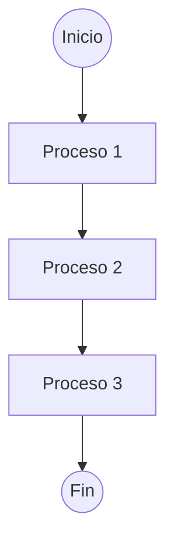
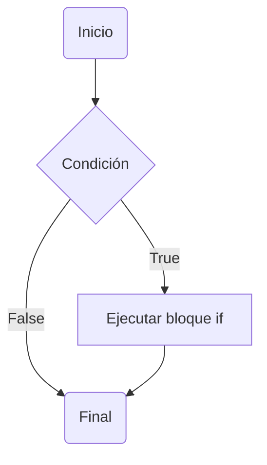
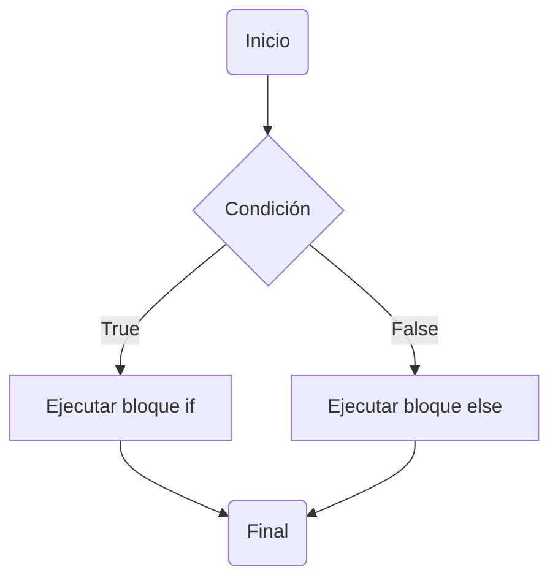
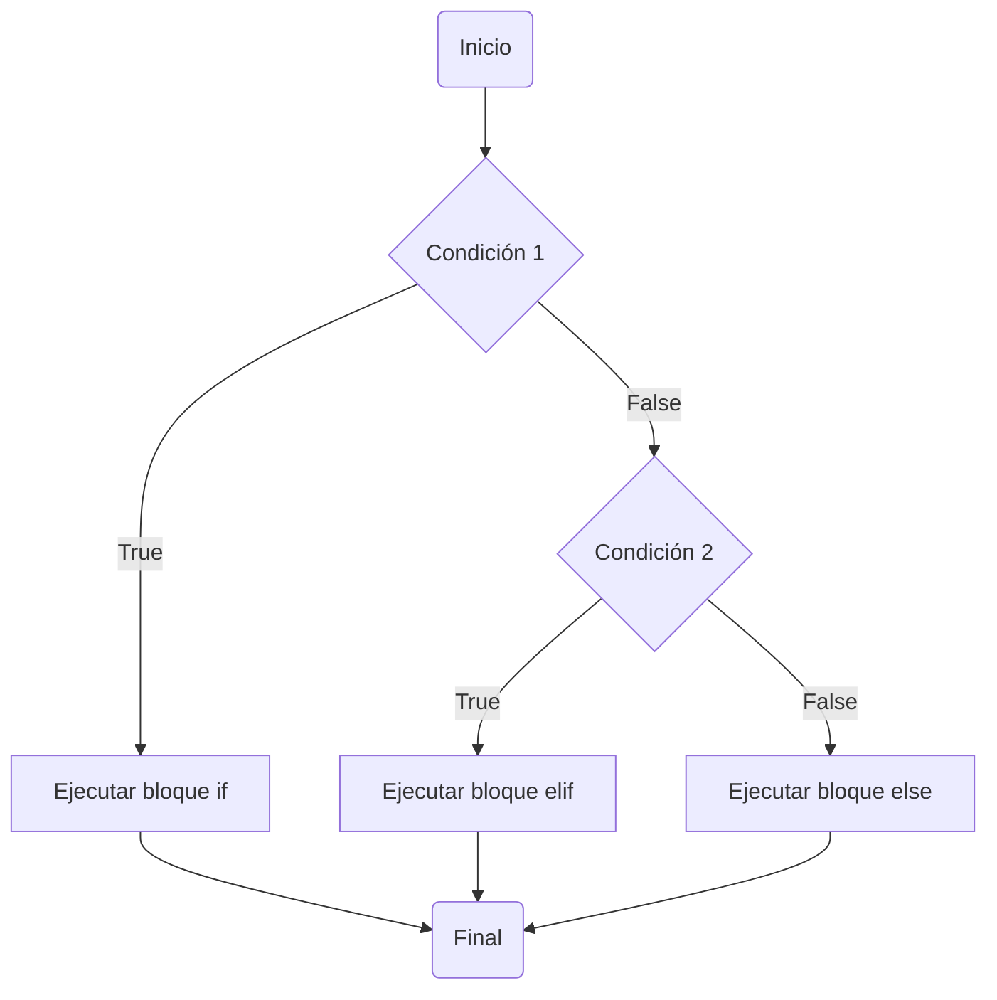
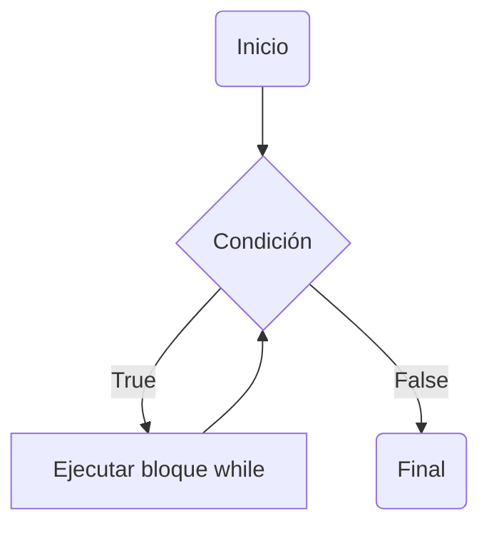
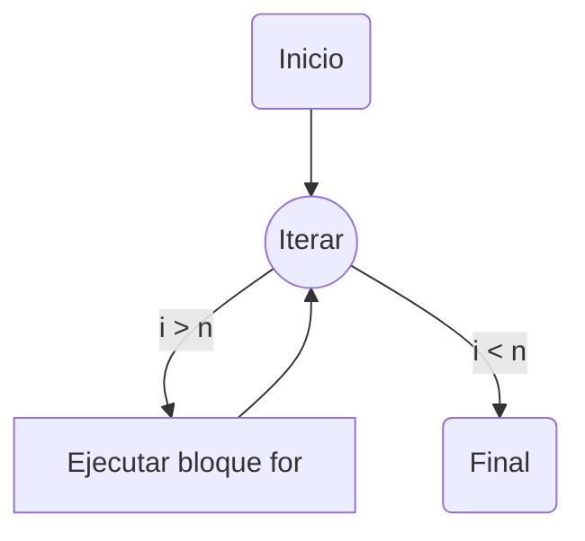

# Python 101: For beginners
---
Python es un lenguaje de programación de alto nivel, con una sintaxis simple y según los programadores "tan sencillo como hablar inglés".

Las aplicaciones de Python son muy bastas y muy variadas gracias a la cantidad de librerías y repositorios de la comunidad.

**Por ejemplo:** *Desarrollo Web, Data Science, Bioinformática, Procesamiento de Imágenes, etc.*

Dicha facilidad y posibilidad de aplicaciones, han convertido a Python es un lenguaje de programación muy popular.


# **Características**
----


* Lenguaje interpretado
>Python es un lenguaje interpretado, lo que significa que ejecuta directamente el código línea por línea, de forma que la línea de código siguiente no puede ser ejecutada sino hasta que la línea anterior finalice su ejecución. Si existen errores en el código del programa, su ejecución se detiene.

* Lenguaje de alto nivel
>Esto implica que es más cercano a los idiomas humanos que otros lenguajes de programación. Por lo tanto, los programadores no deben preocuparse sobre sus funcionalidades subyacentes, como la arquitectura y la administración de la memoria.

* Ordenado por jerarquía
>Python no utiliza llaves. En su lugar, utiliza sangría para organizar los bloques

* Case-Sensitive
<tip> Tiene la capacidad de diferenciar entre mayúsculas y minúsculas al momento de definir o invocar una variable, función, objeto, etc.</tip>

<note>
Por ejemplo:
 VARIABLE ≠ variable ≠ Variable
</note>

# **Sintaxis**
---
Para usar cualquier lenguaje de programación, es necesario conocer dos cosas, las acciones asociadas a ciertas palabras y la sintaxis que rige la ejecución del lenguaje, básicamente, el léxico y la semántica.

### Variables:
Para definir una variable en Python es necesario tener algunas consideraciones para hacerlo de forma correcta.

La comunidad de Python llegó a la convención de usar el "*snake_case*" como la forma más popular de nombrar variables, funciones, objetos, etc.

Tener en cuenta que las variables jamás pueden empezar a ser definida con un número o símbolo, solo letras.

```python
Por ejemplo:

Formas correctas:

  variable = 1
  new_variable = "Hello World"
  variable1 = "Hola"
  
 ```
```python

Formas incorrectas:

  new variable = 10
  "Hello World" = variable
  1ra_variable = 1

```

### **Comentarios**

Los comentarios son secciones o líneas de texto que son ignoradas al momento de la ejecución del programa, 
son muy útiles para marcar o señalar información a lo largo del código, de igual manera, se pueden utilizar para
desactivar líneas o secciones de código incompletas o problemáticas.

Cada lenguaje de programación suele tener combinaciones o símbolos distintos para generar comentarios, cortos y largos.

En Python se generan comentarios cortos utilizando el símbolo **#** y triples comillas para los comentarios largos que a su vez,
pueden ser utilizados en textos largos **"""** **"""**

Ejemplos de uso
:
_Comentario corto_ 
```Python
print(secuencia) # Esta línea muestra la secuencia obtenida
#print(seucencia) se detectó un error, pero, no se soluciona aún
```
_Comentario largo_
```Python
"""
Esta sección del código obtiene información de la base de datos 
para despues procesarla como es debido
"""
procesar(secuencia)
```

### **Funciones**//Se va a reubicar

Una función, en programación es una sección de código reutilizable, o sea, que puede ser llamada/invocada por su nombre varias veces y en todas las ocasiones realizar la misma ejecución. Por un lado, están las funciones Built-In, que están integradas por defecto al lenguaje, sin embargo, se pueden crear funciones propias con las herramientas que el lenguaje ofrezca al programador.

> Al llamar a una función siempre debe respetarse la sintaxis característica, los paréntesis después del nombre de la función

``` Python
 Por ejemplo: 
 
    func( )
    obtener( )
    mostrar( ) 
```
---
# Tipos de Datos
----
En el extenso mundo de la programación existen diferentes tipos de datos y el lenguaje Python, no es la excepción, como 
ya se mencionó estamos trabajando con un lenguaje orientado a objetos, donde cada tipo de dato es una clase de objeto, 
por lo cual, si usamos números, es un dato, si usamos letras, es un dato, si usamos bases de datos, también son un dato.

Para introducirnos a los datos, podemos empezar con los tipos de datos principales y los más usados en los programas básicos

### int( )
>El tipo de dato *int* hace referencia los *Integers*, números enteros reales positivos o negativos, de forma que no cuentan con decimales o puntos.

```python
num = 1
num_1 = 2
new_num = 10
```
>También es posible convertir otros tipos de datos en enteros haciendo uso de la función int(*valor*), donde *valor* es el dato que se desea convertir en un número entero.
```python
variable = 10.0  #Este es un dato tipo float( )
number = "2"   #Este es un dato tipo str( )
num = int(variable)  #Se convierte a entero con int( )
number = int(number)  #Se convierte a entero con int( ) y podemos guardar en la misma variable
print(num)
>> 10
print(number + num)
>> 12
```

### **float( )**

>El tipo de dato *float* hace referencia los *Floats*, números decimales reales, estos siempre tienen un punto decimal o".0" después del número

```python
num = 1.0
num_1 = 2.5
new_num = 10.065
```
>También es posible convertir otros tipos de datos en floats haciendo uso de la función float(*valor*), donde *valor* es el dato que se desea convertir en un número decimal.

```python
variable = 5  #Este es un dato tipo int( )
num = float(variable)  #Se convierte a entero con float( )
print(num)
>> 5.0
```
### **str( )**
>El tipo de dato *str* hace referencia las *Strings*, cadenas de caracteres y texto, estas representaciones son una colección de caracteres que unidos pueden formas palabras, oraciones, secuencias o textos complejos.
```Python
nombre = "Leonardo"
secuencia = "ATGTCTAGTAC"
new_num = "10.50" # Es posible almacenar numeros cómo cadenas, pero, se comportan como texto.
```
>Para convertir datos varios en strings es necesario el uso de la función str(*valor*), donde *valor* es el dato que se desea convertir en una cadena.

```python
variable = 5  #Este es un dato tipo int( )
number = 10.5   #Este es un dato tipo float( )
num = str(variable)  #Se convierte a una cadena con str( )
number = str(number)  #Se convierte a una cadena con str( )
print(num)
>> 5.0
print(num + number)  # Las cadenas no se suman, se concatenan (unen)
>> 510.5
```

### **Otros datos**
Además de los datos mencionados con anterioridad, existen muchos más con características similares y otras particulares para cada tipo, pero que tienen en común es la función de conversión, dada por el nombre del tipo de dato seguido de los paréntesis.

```python
Por ejemplo:
booleanos: bool( )  # Valores lógicos [1, 0]:[True, False]
listas: list( )  # Colección de datos 
tuplas: tuple( )  # Colección de datos
sets: set( ) # Conjunto de datos
diccionarios: dict( ) # Conjunto de datos formato {llave : valor}
```

# Operadores

Los operadores son los símbolos que pueden ser utilizados en python para realizar diferentes trabajos, a continuación
se muestran los operadores aritméticos, condicionales y booleanos

### Aritméticos 
Los operadores aritméticos son en mayor medida los cálculos matemáticos que hacemos de manera cotidiana, definidos por un símbolo y función particular.

Las operaciones disponibles en Python son:

```Ruby
A + B # Suma / Adición
A - B # Resta / Sustracción
A * B # Multiplicación / Producto
A / B # División / Cociente
A // B # División sin decimales / Cociente entero
A % B # Modulo / Residuo de la división
A ** B # Potencia / Elevación
```

**Ejemplos de uso**
:
_(puedes copiar y pegar en una consola de python para probarlo)_
```Python
10 + 5 # El resultado es 15
10 - 10.3 # El resultado es -0.3
"AGG" * 4 # El resultado es "AGGAGGAGGAGG"
10 / 3 # El resultado es 3.33333333
10 // 3 # El resultado es 3
10 % 3 # El resultado es 1
2 ** 3 # El resultado es 8 (2³)
```

<warning>Algunos tipos de datos no son compatibles con ciertas operaciones</warning> 

<note>Algunos operadores aritméticos son compatibles de otros modos con ciertos tipos de datos</note>


### Condicionales 

Los operadores condicionales son aquellos símbolos que nos ayudarán en la toma de decisiones sintéticas, cuestionamientos, dudas o comparaciones entre dos o más valores.
>El funcionamiento de los operadores condicionales los orienta a solo responder con 2 valores, 1 - 0, True - False, Verdadero - Falso.

Las condicionales disponibles en Python son:
```Javascript
A > B # Mayor que
A < B # Menor que
A >= B # Mayor o igual que
A <= B # Mayor o igual que
A == B # Igual que
A != B # Diferente que
A in B # Dentro de
```
**Ejemplos de uso:** 
:
_(puedes copiar y pegar en una consola de python para probarlo)_
```Python
10 > 5 # El resultado es True
10 < 10 # El resultado es False
2.5 >= 2.5 # El resultado es True
3 <= 3.1 # El resultado es True
"Hola" == "hola" # El resultado es False
[1,2,3] != [4,5,6] # El resultado es True
"ACG" in "ATGTCTAGTAC" # El resultado es False
```

<warning>Algunos tipos de datos no son compatibles con ciertos condicionales</warning> 

```Python
# Por ejemplo, no podemos usar
"Hola" > "Adios"
# Porque no está preparado para ser aplicado así
```

<note>Es posible usar la función len( ) que nos permite saber la longitud de una colección de datos, de modo que es posible hacer la comparación.</note>

```Python
len("Hola") > len("Adios") # El resultado es False
```
### Booleanos 

Los operadores booleanos u operadores lógicos, en el caso de python, no se trata de símbolos, si no, de
palabras pequeñas que tienen la capacidad de hacer comparaciones lógicas con valores lógicos estrictamente.

Estos operadores son regidos por tablas de verdad y reglas muy simples.

Tablas de verdad
:
<tabs>
    <tab id="and" title="and">
        El resultado de usar el operador and es Verdadero solo cuando ambos valores son verdaderos
        <table>
            <tr>
                <td>A</td>
                <td>B</td>
                <td>AND</td>
            </tr><tr>
                <td>1</td>
                <td>1</td>
                <td>True</td>
            </tr><tr>
                <td>1</td>
                <td>0</td>
                <td>False</td>
            </tr><tr>
                <td>0</td>
                <td>1</td>
                <td>False</td>
            </tr><tr>
                <td>0</td>
                <td>0</td>
                <td>False</td>
            </tr>
        </table>
    </tab>
    <tab id="or" title="or">
        El resultado de usar el operador or es Verdadero cuando al menos uno de los valores es verdadero
        <table>
            <tr>
                <td>A</td>
                <td>B</td>
                <td>OR</td>
            </tr><tr>
                <td>1</td>
                <td>1</td>
                <td>True</td>
            </tr><tr>
                <td>1</td>
                <td>0</td>
                <td>True</td>
            </tr><tr>
                <td>0</td>
                <td>1</td>
                <td>True</td>
            </tr><tr>
                <td>0</td>
                <td>0</td>
                <td>False</td>
            </tr>
        </table>
    </tab>
    <tab id="not" title="not">
        El resultado de usar el operador not, es el contrario al del valor aplicado, permuta entre 1 y 0
        <table>
            <tr>
                <td>A</td>
                <td>AND</td>
            </tr><tr>
                <td>True</td>
                <td>False</td>
            </tr><tr>
                <td>False</td>
                <td>True</td>
            </tr>
        </table>
    </tab>
</tabs>

Los operadores booleanos disponibles en python son:
```Javascript
# Donde A y B son valores lógicos

A and B # operador and
A or B # operador or
not A # operador not
```

**Ejemplos de uso:**
:
_(puedes copiar y pegar en una consola de python para probarlo)_
```Python
A > 5 and A < 10 # El resultado es veradero si el valor de A se encuentra entre 5 y 10
"T" in codon or "U" in codon # El resultado es verdadero si las letras T o U están presentes en el codon 
not "ACG" in "ATGTCTAGTAC" # El resultado es verdadero si el codon "ACG" falta en la secuencia
```

## Estructuras de control

Python es un lenguaje con diferentes estructuras de control, las cuales pueden ayudarnos en la solución de
diferentes problemas o situaciones.

En este caso estudiamos las tres principales y más importantes del paradigma estructurado.

### Secuencial
Más que una estructura particular, se trata de la forma general en la cual código se escribe y ejecuta 
según la lógica del lenguaje.

En palabras simples, el código de python en un programa completo se ejecuta secuencialmente, una línea
tras otra, de forma que no se ejecutará la línea de código siguiente hasta que la ejecución de la anterior
no termine.

Ejecución
:


<note>
A diferencia de como leemos convencionalmente, el intérprete de python lee el código de derecha a izquierda,
desde el paréntesis más interno hasta el más externo.
</note>


### Selectiva

If
:
La sentencia <format style="bold" color="MediumPurple">_if_</format> (_condición_): es el bloque de condición
**simple** de python, con solo una pregunta y una respuesta.


La forma de usar if es la siguiente:

````Python
A = 10
B = 5

if A > B :
    print("Hola")
    
print("Fin del programa . . .")
````
El código anterior muestra un bloque if, el cúal recibe la condición `A > B`, si el resultado de la comparación
es True, entonces el contenido del bloque será ejecutado, en caso de ser False, el contenido del bloque será
ignorado y el código continuará con normalidad.

If-Else
:
La sentencia <format style="bold" color="MediumPurple">_if_</format> (_condición_): - <format style="bold" color="MediumPurple">_else_</format>:
es el bloque de condición **doble**, con una pregunta y dos respuestas.


La forma de usar if-else es la siguiente:

````Python
A = 10
B = 5

if A%B == 0 :
    print("Perfecto")
else:
    print("Imperfecto")
    
print("Fin del programa . . .")
````
El código anterior muestra un bloque if-else, el cúal recibe la condición `A%B == 0`, si el resultado de la comparación
es True, entonces el contenido del bloque **if** será ejecutado, en el caso contrario, el bloque **else** será ejecutado.

If-Elif-Else
:
La sentencia <format style="bold" color="MediumPurple">_if_</format> (_condición_): - <format style="bold" color="MediumPurple">_elif_</format> (_condición_): **...** <format style="bold" color="MediumPurple">_else_</format>:
es el bloque de condición **múltiple**, con dos o más preguntas y n + 1 respuestas.

Una de las ventajas del bloque if-elif-else es la cantidad infinita de preguntas que pueden ser realizadas.

La forma de usar if-elif-else es la siguiente:

````Python
secuencia = "ATGTCTAGTAC"

if "U" in secuencia:
    print("ARN")
elif "T" in secuencia:
    print("ADN")
else:
    print("Secuencia inválida")
    
print("Fin del programa . . .")
````
El código anterior muestra un bloque if-elif-else, el cúal recibe varias condiciones, si el resultado de la comparación
es True en la sentencia if, entonces el contenido del bloque **if** será ejecutado y serán ignoradas el resto de preguntas, en el caso contrario, el programa ejecutará
el bloque elif, si la comparación es verdadera, el contenido de **elif** será ejecutado y else, ignorado, pero, si nunguna
de las preguntas llega a ser verdadera, entonces **else** será ejecutado como última acción. 

### **Iterativa**

While
:
El **bucle** while es una estructura repetitiva condicional, esto significa que mientras la condición dada sea verdadera,
el contenido de while será ejecutado.

El funcionamiento de while implica que si la condición es True todo el tiempo, la cantidad de veces que se ejecute podrían
ser infinitas, llegando a generar pausas indefinidas en el programa, misma razón por la cual se le conoce como **bucle**.


La forma de usar while es la siguiente:

````Python
datos = [1, 2, 10, 5, 3]
i = 0
a = 0
n = len(datos)

while i < n:
    print(datos[i])

print("Fin del programa . . .")
````
El código anterior muestra un bloque while, estos bloques se caracterizan por la necesidad de tres variables particulares,
el contador `i`, el limitador `n` y el acumulador `a`; while, al ser un bucle condicional es posible usarlo en diversas
aplicaciones que requieren reintentar el proceso hasta que el resultado deseado no es obtenido, lo cuál puede llevar algunos
pocos o infinitos intentos, en el ejemplo anterior podemos ver el modo "contador" de while, simulando el funcionamiento de
for_in con algunos pasos extras.

````Python
while True:
    numA = int(input("Ingrese un número entero: "))
    numB = int(input("Ingrese otro número entero: "))
    
    print(f"La suma de {numA} + {numB} = {numA + numB}")
    
    opcion = input("Desea repetir el programa? [Y/N]:  ")
    
    if opcion == "N":
        break
        
print("Fin del programa . . .")
````

El ejemplo anterior muestra el uso de while en modo "infinito", esto es cuando se le otorga un valor lógico directamente
en vez de una condición, este modo es utíl para entrar en bucles infinitos controlados desde el interior usando `break` o `continue`.

Además, podemos observar la presencia de las funciones de entrada y salida `E/S - I/O`, `input( )` y `print( )` respectivamente.

<note>
Existen palabras reservadas exclusivamente para las estructuras iterativas como lo son 
<format style="bold">break</format> y <format style="bold">continue</format>.
<deflist>
    <def title="Break">
        break, es la palabra reservada para "romper" la ejecución de los bloques while y for, para ser
        usada solo es necesario buscar la forma de llamarla durante la ejecución del bloque, una forma
        sencilla de manejarlo es con un bloque if, si la condición es cumplida, ¡break al programa!
    </def>
    <def title="Continue">
        continue es la palabra reservada para "saltar" vueltas sin detener la ejecución del bloque,
        digamos que si cierta condición se cumple no queremos que esa vuelta en particular sea realizada, pero
        tampoco que se detenga todo, si no, solo evitar esa ejecución en particular.
    </def>
</deflist>
</note>

For_in
:
El **ciclo** for, una estructura iterativa con una lógica fija, a diferencia del bucle while, este necesita iterar a través
de una secuencia o colección de datos, que será enviada a su variable auxiliar  un dato a la vez e introducida a la ejecución del bloque for

donde _i_ es la variable auxiliar y _n_ la cantidad de valores en la secuencia.

La forma de usar for_in es la siguiente:

````Python
datos = [1, 2, 10, 5, 3]

for variable_aux in datos:
    print(variable_aux)
    
print("Fin del programa . . .")
````
El código anterior muestra un **ciclo** for, donde la variable auxiliar es `variable_aux` la cual tomará cada uno de los
valores de `datos` a cada "vuelta" y los mostrará por medio de `print( )`

<note>
Es posible usar como secuencia cualquier tipo de dato que sea de comportamiento 
<format style="bold">iterable</format>, es decir que contenga a más objetos en su interior, por ejemplo:
listas, tuplas, sets, diccionarios, cadenas, etc.
</note>

El ciclo for_in de python es apreciado en diversas áreas, debido a su simplicidad es posible hacer procesamientos extensos
usando solo ciclos for_in

```Python
matriz = []
size = 5

for i in range(size):
    matriz.append([])
    for j in range(size):
        matriz[i].append(j+i)

print(matriz)
```
El ejemplo anterior es un programa sencillo con la capacidad de generar matrices númericas cuadradas con tamaño `size`
y valores, 

¿cómo haríamos si quisiéramos acceder a cada uno de esos valores?

```Python
matriz = []

for fila in matriz:
    for col in fila:
        print(col)
```
{collapsible="true" collapsed-title="Acceso Matriz"}
